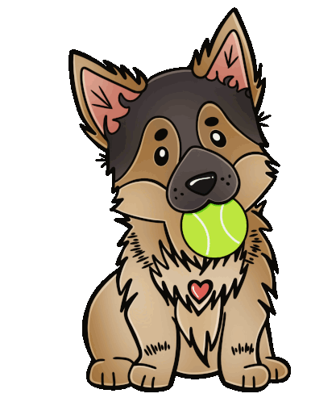

  
  <em style="font-size: 11px;">(Click ⬆️ for my portfolio!)</em>

<h1 align="center">Hi! I'm Chan! </h1>

<h3 align="center"><b>About Me:</b></h3>

 

  Software Engineer graduate at <a href="https://www.appacademy.io/">appAcademy</a>
   She/her or CODE-HER
   I’m a full-stack developer, with a passion for backend development and data structure.
   Obsessed with learning! And coffee!

 
<h3 align="center"> <b>Tech Stack</b></h3>

 
<h3 align="center"> <b>Stats</b></h3>

<table align="center">
<tr border="none">

<td width="%" align="center">

  </td>
</tr>
</table>

 
<h3 align="center"><b>Let's Connect</b></h3>

<!--
**vinob09/vinob09** is a ✨ _special_ ✨ repository because its `README.md` (this file) appears on your GitHub profile.

Here are some ideas to get you started:

- 🔭 I’m currently working on ...
- 🌱 I’m currently learning ...
- 👯 I’m looking to collaborate on ...
- 🤔 I’m looking for help with ...
- 💬 Ask me about ...
- 📫 How to reach me: ...
- 😄 Pronouns: ...
- ⚡ Fun fact: ...
-->
